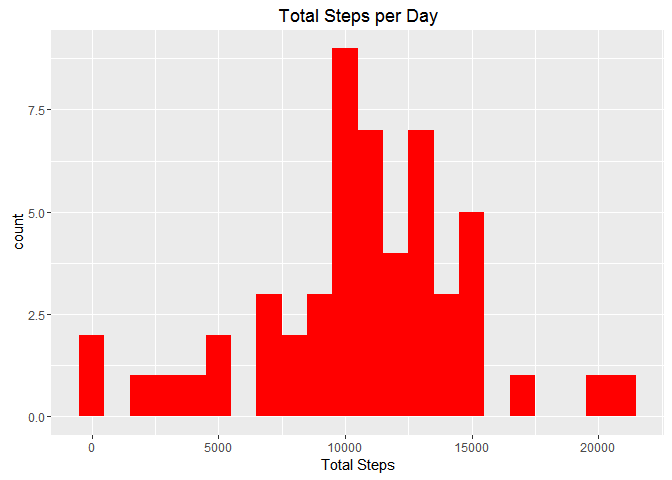
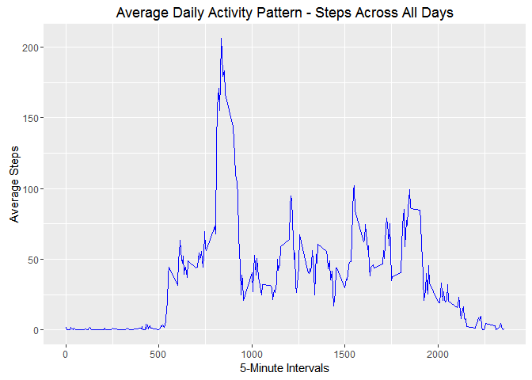
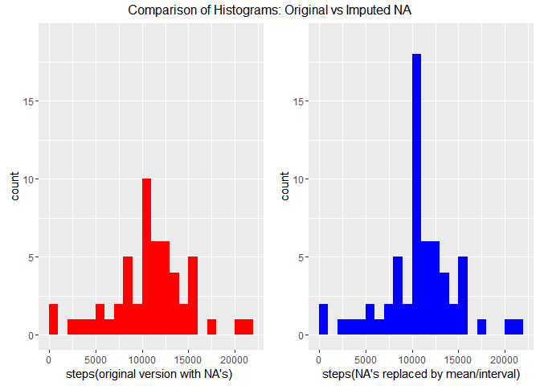
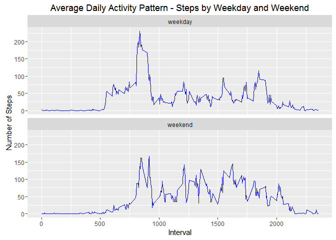

# Reproducible Research - Assignment 1
Bill Roka  
May 6, 2016  


# Loading and preprocessing the data


Load necessary libraries for analysis (install packages if necessary).


```r
library(dplyr)
library(ggplot2)
library(knitr)
library(gridExtra)
```


Unzip and Load data. Unzip files to working folder. The date field is transformed to date format using the "colClasses" syntax.


```r
unzip(zipfile="./activity.zip")
activity <- read.csv("activity.csv", header = TRUE, colClasses = c("numeric", "Date", "numeric"))
```


# What is mean total number of steps taken per day?


For this part of the assignment, you can ignore the missing values in the dataset.

1) Make a histogram of the total number of steps taken each day.

  Note: Per instructions, nulls are ignored for this calculation (they are not part of the calculation of the denominator).


```r
# First, calculate total steps per day, ignoring nulls (removes them from the denominator)
steps_per_day <- activity %>% 
                  group_by(date) %>% 
                    summarise(Steps = sum(steps))

# Now, create histogram. Leaving the binwidth at 1000 to show gaps in the data.
qplot(Steps, 
                    data = steps_per_day,  
                    main = "Total Steps per Day", 
                    xlab = "Total Steps",
                    binwidth = 1000,
                    fill = I("red"))
```

<!-- -->


2) Calculate and report the mean and median total number of steps taken per day.


```r
# The mean
mean(steps_per_day$Steps, na.rm = TRUE)
```

```
## [1] 10766.19
```

```r
# The median
median(steps_per_day$Steps, na.rm = TRUE)
```

```
## [1] 10765
```

  
  <span style="color:Indigo;font-weight:bold">The mean number of total steps per day are 10,766.19 and the median is 10,765. Quite close.</span>


# What is the average daily activity pattern?
 
1) Make a time series plot (i.e. type = "l") of the 5-minute interval (x-axis) and the average number of steps taken, averaged across all days (y-axis)


```r
##Find average steps for all days

avg_steps_by_interval <- activity %>% 
                          group_by(interval) %>%
                            summarise(avg_steps = mean(steps, na.rm = TRUE))
## Creating time series plot

ggplot(avg_steps_by_interval, aes(interval, avg_steps)) + 
        geom_line(color = "blue") +
        xlab("5-Minute Intervals") + 
        ylab("Average Steps") +
        ggtitle("Average Daily Activity Pattern - Steps Across All Days")
```

<!-- -->


2) Which 5-minute interval, on average across all the days in the dataset, contains the maximum number of steps?


```r
## find the interval value with the max number of steps, on average across all days
avg_steps_by_interval[which.max(avg_steps_by_interval$avg_steps),1]
```

```
## Source: local data frame [1 x 1]
## 
##   interval
##      (dbl)
## 1      835
```

  <span style="color:Indigo;font-weight:bold">Interval 835 contains the maximum number of steps.</span>
  

# Imputing missing values

Note that there are a number of days/intervals where there are missing values (coded as NA). The presence of missing days may introduce bias into some calculations or summaries of the data.
 
1) Calculate and report the total number of missing values in the dataset (i.e. the total number of rows with NAs)


```r
sum(!complete.cases(activity)) # 2,304 total rows with null values
```

```
## [1] 2304
```

  <span style="color:Indigo;font-weight:bold">There are 2,304 total rows with null values.</span>

2) Devise a strategy for filling in all of the missing values in the dataset. The strategy does not need to be sophisticated. For example, you could use the mean/median for that day, or the mean for that 5-minute interval, etc.

  <span style="color:Indigo;font-weight:bold">My chosen strategy for replacing nulls is to use the MEAN of the 5-minute interval:</span>


```r
## impute NA with INTERVAL AVERAGE
impute.mean <- function(x) replace(x, is.na(x), mean(x, na.rm = TRUE))
```


3) Create a new dataset that is equal to the original dataset but with the missing data filled in.


```r
## Set steps to mean of steps, grouped on interval. Build new version of the table as "activity_replace_nulls".
activity_replace_nulls <- activity %>%
                            group_by(interval) %>%
                              mutate(
                                steps = impute.mean(steps) 
                              )
```
 
4) Make a histogram of the total number of steps taken each day and Calculate and report the mean and median total number of steps taken per day.

  *Note: for the purpose of comparison, I'm displaying both the original graph and the new version with imputed NAs side-by-side.* 
   

```r
steps_per_day_rn <- activity_replace_nulls %>% 
                    group_by(date) %>%
                    summarise(Steps = sum(steps))

## Now, create histogram. Leaving the binwidth at 1000 to show gaps in the data.

## compare original histogram with new imputed version

g1 <- ggplot(steps_per_day, aes(x = Steps)) + 
  geom_histogram(fill = "red", boundary=0.1, binwidth=1000) + 
  ylim(0,19) + xlab("steps(original version with NA's) ")
g2 <- ggplot(steps_per_day_rn, aes(x = Steps)) + 
  geom_histogram(fill = "blue", boundary=0.1, binwidth=1000) + 
  ylim(0,19) + xlab("steps(NA's replaced by mean/interval)")
grid.arrange(g1, g2, ncol = 2, top = "Comparison of Histograms: Original vs Imputed NA")
```

<!-- -->

Calculate and report the mean and median total number of steps taken per day


```r
mean(steps_per_day_rn$Steps, na.rm = TRUE)
```

```
## [1] 10766.19
```

```r
median(steps_per_day_rn$Steps, na.rm = TRUE)
```

```
## [1] 10766.19
```

  <span style="color:Indigo;font-weight:bold">The mean number of total steps per day are 10,766.19 and the median is the same value,  10,766.19.</span>

Do these values differ from the estimates from the first part of the assignment? 

  <span style="color:Indigo;font-weight:bold">The mean and the median are virtually identical to the estimates from the original calculation.</span>

What is the impact of imputing missing data on the estimates of the total daily number of steps?

  <span style="color:Indigo;font-weight:bold">Replacing the NA values with the mean in effect re-emphasized the average value of the data (10,766.19) and caused that portion of the histogram to greatly increase in terms of frequency.  This explains the equivalence of the median and mean in the
  new calculation.</span">

# Are there differences in activity patterns between weekdays and weekends?

For this part the weekdays() function may be of some help here. Use the dataset with the filled-in missing values for this part.

1) Create a new factor variable in the dataset with two levels -- "weekday" and "weekend" indicating whether a given date is a weekday or weekend day.


```r
## Modifying the date field in activity_replace_nulls to date format

activity_replace_nulls$date <- strptime(activity$date,"%Y-%m-%d")

## Adding "weekday flag", and then adding logic. Converting field to factor.

activity_replace_nulls$weekday_flag <- weekdays(activity_replace_nulls$date)

activity_replace_nulls <- mutate(activity_replace_nulls, weekday_flag = as.factor(ifelse(weekday_flag %in% c("Saturday","Sunday"),"weekend","weekday")))
```

2) Make a panel plot containing a time series plot (i.e. type = "l") of the 5-minute interval (x-axis) and the average number of steps taken, 
averaged across all weekday days or weekend days (y-axis). 


```r
## Creating average by interval and weekday. Only bringing in columns we need (interval, steps and weekday flag)

avg_steps_by_interval_weekday <- activity_replace_nulls[,c(1,3,4)] %>% 
                                  group_by(interval, weekday_flag) %>%
                                  summarise(avg_steps = mean(steps))
## Creating time series plot

ggplot(avg_steps_by_interval_weekday, aes(interval, avg_steps)) + 
  geom_line(color = "blue") +
  facet_wrap(~ weekday_flag, ncol = 1) +
  xlab("Interval") + 
  ylab("Number of Steps") +
  ggtitle("Average Daily Activity Pattern - Steps by Weekday and Weekend")
```

<!-- -->

  <span style="color:Indigo;font-weight:bold">As demonstrated in the comparison above, there is a marked difference between the activity patterns on weekdays and    weekends. The weekday data has one large, emphasized spike, whereas the weekend data is more level. Presumably, this is a result of
  circumscribed periods of activity during the week (lunch breaks, after work), as opposed to the weekend, when there is more
  free time to walk.</span>
